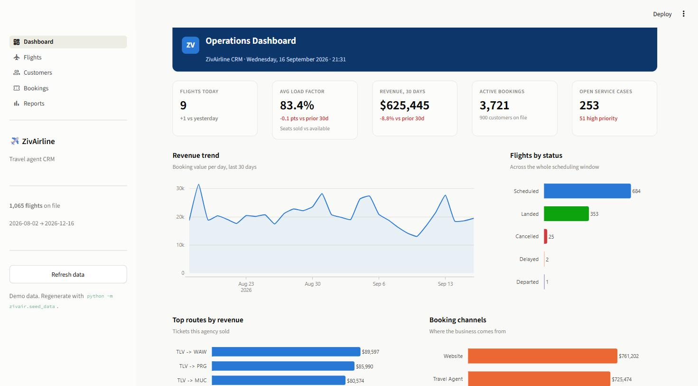
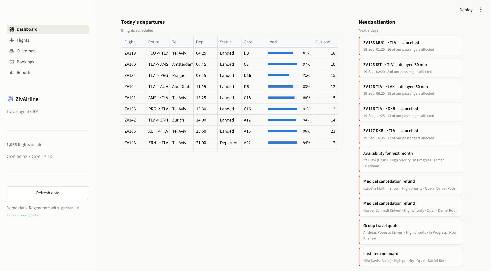

# ZivAirline CRM

A CRM for the travel agents of **ZivAirline** — track flights, manage customers, and
handle the bookings that connect the two. Built with **Streamlit** on top of a
**SQLite** database filled with synthetic but realistic airline data.

> Teaching demo. Every customer, booking and flight in this repository is generated
> by `zivair/seed_data.py` — no real personal data is involved.

---

## Screenshots

**Dashboard — how the airline is doing right now**



**Dashboard — today's board and what needs attention**



---

## What it does

| Area | Question it answers | Status |
|------|---------------------|--------|
| **Dashboard** | How is the airline doing right now? Load factor, revenue, flight status, open service cases, today's departures, disruptions. | ✅ Built |
| **Flights** | Which flights are scheduled, delayed or cancelled — and who is on board? | ✅ Built |
| **Customers** | Who is this passenger, what is their history and how valuable are they? | Phase 4 |
| **Bookings** | Book a customer onto a flight, change a seat, check them in, cancel a trip. | Phase 5 |
| **Reports** | Revenue by route, channel mix, loyalty distribution, agent performance. | Phase 6 |

---

## Quick start

```bash
# 1. install dependencies
pip install -r requirements.txt

# 2. generate the demo database (data/zivairline.db)
python -m zivair.seed_data

# 3. run the app
streamlit run app.py
```

The app opens at <http://localhost:8501>.

Regenerating the data is always safe — `seed_data.py` drops and rebuilds every table:

```bash
python -m zivair.seed_data --seed 7        # a different random world
python -m zivair.seed_data --db /tmp/x.db  # write somewhere else
```

---

## Project layout

```
crm/
├── app.py                    # Streamlit entry point: page config, database check, navigation
├── requirements.txt
├── .streamlit/config.toml    # theme, pinned to light so the chart palette stays valid
├── data/
│   └── zivairline.db         # generated, not committed
├── docs/screenshots/
└── zivair/
    ├── config.py             # paths, constants, business vocabulary
    ├── schema.sql            # the whole data model, commented
    ├── database.py           # connection + query helpers (no domain logic)
    ├── reference_data.py     # airports, fleet, agents, name pools
    ├── seed_data.py          # the synthetic data generator
    ├── queries.py            # every question the UI asks the database
    └── ui/
        ├── theme.py          # palette, CSS, KPI tiles, chart styling
        ├── dashboard.py      # the Dashboard screen
        ├── flights.py        # the Flights screen: board, filters, manifest
        └── placeholders.py   # the screens still on the roadmap
```

### Layers

```
Streamlit UI (app.py, ui/)   screens, forms, charts
        │
   queries.py                business logic + SQL
        │
   database.py               connections, DataFrames, transactions
        │
   SQLite
```

Each layer only knows the one below it: `database.py` has never heard of a flight,
and `dashboard.py` never writes SQL.

---

## The data model

Nine tables. The interesting one is `tickets` — it is the many-to-many join that
turns a *customer* and a *flight* into a *seat*.

```
airports ──< routes >── airports
                │
                ▼
aircraft ──> flights <── tickets ──> bookings ──> customers
                                         │            │
                                       agents      interactions
```

| Table | Rows (default seed) | Holds |
|-------|--------------------:|-------|
| `airports` | 23 | The network ZivAirline serves, hub = TLV |
| `aircraft` | 14 | The fleet, with per-cabin seat counts |
| `agents` | 6 | The people using this CRM |
| `routes` | 44 | Every hub leg, both directions, with distance |
| `customers` | 900 | Passengers, loyalty tier, segment, market |
| `flights` | ~1,065 | 45 days back, 90 days forward, with live status |
| `bookings` | ~6,700 | A PNR: who booked, through which channel, for how much |
| `tickets` | ~10,100 | One passenger on one flight, with a seat |
| `interactions` | 700 | The service log: complaints, changes, refunds |

**Two details worth knowing:**

- `flights.seats_sold` counts seats sold through *every* channel, while `tickets`
  only holds the passengers **this agency** booked. That is what an agency CRM
  really looks like: you see the whole aircraft, but you own a slice of it.
- The flight window is anchored to the day you run the generator, so the demo
  always contains yesterday, today and next month.

---

## How the data is made realistic

The generator is not just `random.choice` everywhere. It encodes real airline behaviour:

- **Booking curve** — a passenger whose draw lands in the future simply has not booked
  yet, so a flight three months out is lightly sold and tomorrow's flight is full.
- **Fare ladder** — book 90 days ahead and pay 0.82× the base fare; book the day before and pay 1.45×.
- **Fleet assignment** — a 9,100 km leg to JFK can only be flown by a wide-body with the range for it.
- **Loyalty follows activity** — points are earned per flown kilometre (business ×2), and the
  tier is derived from the points, producing a realistic pyramid rather than a flat split.
- **Segment drives behaviour** — business and VIP customers fly more often, book business class
  more often, and reach the agent through the call centre rather than the website.

---

## About the charts

The dashboard uses a pre-validated visualisation palette, and three rules it never breaks:

1. **Categorical hues are assigned in fixed order, never cycled** — the order is chosen so
   adjacent pairs stay distinguishable under colour-vision deficiency.
2. **A ranking gets one hue, not eight.** Colour would encode nothing there, so the bars
   carry a direct value label instead.
3. **Status colours are reserved** and always ship with their text label, so colour is never
   the only carrier of meaning.

The app is pinned to the light theme in `.streamlit/config.toml` because the palette was
validated against that surface.

---

## Development phases

| Phase | Scope | Status |
|-------|-------|--------|
| 1 | Data model, synthetic data generator, documentation | ✅ Done |
| 2 | Query layer, app shell, Dashboard | ✅ Done |
| 3 | Flights module + passenger manifest | ✅ Done |
| 4 | Customers module + 360° customer card | ⬜ |
| 5 | Bookings module (create / change / check-in / cancel) | ⬜ |
| 6 | Reports, polish, final documentation | ⬜ |

Full documentation lives in the Obsidian vault under `ZivAirline-CRM/`.

---

## Requirements

Python 3.10+, plus `streamlit`, `pandas`, `plotly`. See `requirements.txt`.
